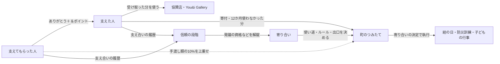
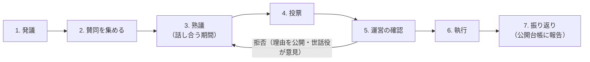

# You&i Space 評価経済の設計書

**DAO的な仕組み（寄り合い）と、＆ポイント・信頼の段階の棲み分け**

| 項目 | 内容 |
|---|---|
| 版 | 設計案 v0.1（ドラフト） |
| 作成日 | 2026-09-29 |
| 対象 | アプリ v0.5.2（`index.html`／`firestore.rules`） |
| 位置づけ | アプリの実装とコメントから、設計の意図を読み取ってまとめた案。コードが正本として挙げる「戦略指針§5-6」との突き合わせは、まだ行っていない（→ §13） |
| 実装への反映 | 本書では行わない。段階的な実装の計画は §12 |

---

## 目次

0. [要約](#0-要約)
1. [前提（今回決めたこと）](#1-前提今回決めたこと)
2. [評価経済の全体像](#2-評価経済の全体像)
3. [現状（v0.5.2）の棚卸し](#3-現状v052の棚卸し)
4. [設計の原則（評価経済の憲章案）](#4-設計の原則評価経済の憲章案)
5. [＆ポイントと信頼の段階の棲み分け](#5-ポイントと信頼の段階の棲み分け)
6. [寄り合い（DAO的なガバナンス）](#6-寄り合いdao的なガバナンス)
7. [町のつみたて（コモンズ）の設計](#7-町のつみたてコモンズの設計)
8. [不正と歪みへの対策](#8-不正と歪みへの対策)
9. [有事（災害モード）での扱い](#9-有事災害モードでの扱い)
10. [将来のオンチェーン化の道筋](#10-将来のオンチェーン化の道筋)
11. [データモデル案（Firestore）](#11-データモデル案firestore)
12. [実装の段階と評価指標](#12-実装の段階と評価指標)
13. [未決事項](#13-未決事項)
- [付録A 用語集](#付録a-用語集)
- [付録B パラメータ一覧（現行値と提案値）](#付録b-パラメータ一覧現行値と提案値)
- [付録C 利用規約 第5条の改定案](#付録c-利用規約-第5条の改定案)

---

## 0. 要約

**ひとことで言うと**

> **＆ポイントは貸し借りを「閉じる」ための道具、信頼の段階は関係を「開く」ための履歴。**
> 運営は完全なDAOを名乗らない。そのかわりに、利用者に委ねる範囲を明文化し、運営自身の操作を記録・公開し、非常時の権限には期限をつける。これによって、DAO的な自治を少しずつ広げていく。

**主な提案（10項目）**

| # | 提案 | 節 |
|---|---|---|
| 1 | 棲み分けを「3つの互酬」で定義する。＆ポイント＝その場で釣り合わせる互酬、信頼の段階＝巡り巡る互酬の履歴、町のつみたて＝再分配 | §2.1 |
| 2 | ポイント・信頼・票を互いに変換しない（ファイアウォール） | §5.3 |
| 3 | 信頼の段階が何を解錠するかを「解錠表」で決める。頼ること・支えること・お礼には、どの段階でも条件をつけない | §5.4 |
| 4 | ＆ポイントを「渡す枠（毎月戻る・交換できない）」と「受け取った分（使える）」の2つに分ける。残高が0でもお礼ができ、複数アカウントでの水増しも防げる | §5.6 |
| 5 | 町のつみたてを実際に積み立てる（手渡しのたびに10%を上乗せ、使わなかった分は町に還る）。使い道は町の投票で決める | §7 |
| 6 | 権限を「憲章＋3層」に分ける：運営が持つもの／運営と利用者で共同決定するもの／町が決めるもの | §6.2 |
| 7 | 投票は1人1票。信頼の段階は「発議の資格」にだけ使い、票の重みにはしない | §6.3 |
| 8 | 「運営の約束」と公開台帳で、運営の操作を記録・公開する | §6.5〜6.6 |
| 9 | いまの実装の穴（残高をサーバーで検証していない、支え合いの記録を片側だけで作れる、など）を最初に塞ぐ（Phase 0） | §3.3、§8 |
| 10 | ブロックチェーンは「台帳のハッシュの記録 → 信頼の証明書」の順に導入する。＆ポイントのトークン化は勧めない | §10 |

---

## 1. 前提（今回決めたこと）

| 論点 | 決定 |
|---|---|
| 利用者（コミュニティ）に委ねる領域 | ①町のつみたての使い道　②評価経済のルール改定　③ポイントの出口（協賛店・Gallery）の選定　④その他（**内容未受領** → §13） |
| 運営に残す領域 | 見守り（通報の審査・利用停止）、本人確認、災害モードの発動、安全・法令・個人情報、システムの保守 |
| 技術基盤 | 当面は Firestore（オフチェーン）。将来オンチェーンに移行するための道筋を設計に含める |
| 正本 | アプリのコード（v0.5.2）とコメントから読み取る |

---

## 2. 評価経済の全体像

本書では、次の6つをまとめて「評価経済」と呼ぶ。

| 要素 | ひとことで | 性質 |
|---|---|---|
| ＆ポイント | ありがとうの手渡し | **流れる**もの（フロー） |
| 信頼の段階（水引の結び名・5段階） | 支え合いの履歴 | **貯まる**もの（ストック） |
| よく言われること（言葉） | どんな人か | **質**（点数にしない） |
| 活動中 | いまの状態（直近90日） | **状態** |
| 町のつみたて | 町の共有の蓄え | **共有**（コモンズ） |
| 寄り合い（ガバナンス） | 決め方 | **ルール** |



### 2.1 3つの互酬による整理

経済人類学のポランニーは、経済を支える型を「互酬・再分配・交換」に分けた。サーリンズはさらに、互酬を「一般化された互酬」と「均衡的な互酬」などに分けている。この枠組みを当てはめると、各要素の役割がきれいに分かれる。

| 型 | 評価経済で担うもの | 役割 |
|---|---|---|
| **均衡的な互酬**（その場で釣り合わせる） | ＆ポイント | 1対1の貸し借りを、その場で閉じる。負い目を残さない（アプリの「お互いさま」） |
| **一般化された互酬**（巡り巡って返す） | 信頼の段階・言葉 | 「いつか誰かに返せばよい」という関係の履歴。多くの人と支え合うほど育つ |
| **再分配**（共同体に集めて配り直す） | 町のつみたて | 個人どうしのやり取りを、町の資産に変える |
| **交換**（市場） | 協賛店・Gallery での交換 | ＆ポイントの出口。ただし換金はしない |

> 名前の由来とも重なる。日本の「結（ゆい）」は、田植えや屋根葺きの労働を対等に貸し借りする仕組み（均衡的な互酬）。一方、村の「寄り合い」は、みんなに関わることを納得するまで話し合って決める場だった（宮本常一『忘れられた日本人』）。本書は、ガバナンスの部分を **「寄り合い」** と呼ぶことを提案する。

---

## 3. 現状（v0.5.2）の棚卸し

### 3.1 実装されているもの

| 要素 | 実装（`index.html`） | 内容 |
|---|---|---|
| 信頼の段階 | `TRUST_STAGES`／`computeTrust()` | はじめの結び(0)・ひと結び(20)・あわじ結び(55)・梅結び(110)・結い手(200)。見せるのは段階名だけで、内部の値は運営だけが持つ |
| 信頼の計算 | `WEIGHTS`、`DEAL_PT`、`MONTH_PT`、`VERIFY_PT` | 同じ相手との1〜4回目以降のありがとうを 3／2／1／0.5 と逓減させる。支え合いの記録 +0.5、活動した月 +1、本人確認 +5。有事のものは加点しない |
| 言葉 | `THANKS_TAGS_TO_HELPER`／`TO_ASKER` | 感謝タグを点数にせず、言葉のまま残す。送り主は表示しない |
| ＆ポイント | `START_PT`、`myPoints()`、`sendThanks()` | 登録時に300pt。手渡しは 0／30／50／100pt。残高は「300＋受け取った合計−手渡した合計」で、端末側が計算している |
| ポイントの出口 | `redeem()` | 協賛店・Gallery・寄付のメニューはあるが、実際のアカウントでは「準備中」 |
| 町のつみたて | 画面の表示だけ | 「4,200 / 10,000 pt」は固定値 |
| ゲート | `gateBlocked()`／`openDeals()` | 支え合いが終わったら、72時間以内にお礼を伝えるかどうかを決める。決めるまでは新しい「困っていること」を出せない。災害時と本人の解除（24時間）では外れる |
| 支える人への声かけ | `careShouldShow()` | 支えた回数が3回以上で、支えられた回数の3倍以上のとき、「頼っていい」と声をかける |
| 少し気になった／通報 | `concerns`／`reports` | 運営だけが読む。公開の低評価はない |
| 活動の記録（証明書） | プロフィール画面 | 学校・勤め先・地域の活動に提出できる記録 |

### 3.2 すでに良い設計（そのまま維持するもの）

- 点数を出さず、**段階名だけ**を見せる
- **同じ相手との繰り返しは逓減**させ、多くの人と支え合うほど伸びるようにしている
- **ポイントの額を信頼の計算に入れていない**（`computeTrust()` は回数だけを数える）。0pt のありがとうでも、信頼の重みは同じ
- **支えられたことも実績に数える**（受援の尊厳）
- **有事の善意は加点しない**
- 低い評価を公開せず、「少し気になった」は運営が非公開で受け取る
- 段階（資格）と「活動中」（状態）を**分けている**
- ゲートは「迷ったら外す側に倒す」
- ＆ポイントの残高は**本人にしか見えない**（`users` と `thanks` の読み取りを制限している）

### 3.3 課題（ギャップ）

| # | 課題 | 何が起きるか | 深刻度 |
|---|---|---|---|
| G1 | **信頼の段階が何に効くのか決まっていない** | コードのコメントには「権限の解錠は『支えた』だけで判定する」とあるが、実装はない。画面の説明（「助けを求めることにも、段階の条件はありません」）とも食い違う。段階を上げる意味が伝わらず、ガバナンスの資格にも使えない | 中 |
| G2 | **＆ポイントの残高をサーバーで検証していない** | `thanks` のルールは points が {0,30,50,100} のどれかであることしか確かめない。残高は端末の `myPoints()` だけで判定しているため、改造した端末からは残高を超えて何度でも手渡せる。アカウントが2つあれば、ポイントを際限なく増やせる | **高**（協賛店での交換を始める前に必ず塞ぐ） |
| G3 | **登録時の300ptの配布** | 「運営が配るものではありません」という説明と矛盾する。アカウントを作るほど総量が増え、複数アカウントから本命のアカウントに集められる | **高** |
| G4 | **支え合いの記録（`deals`）を片側だけで作れる** | 相手の同意なしに作れるため、相手のゲートを閉じられる（相手が「困っていること」を出せなくなる）。+0.5 の水増しもできる | 中〜高（嫌がらせに使える） |
| G5 | **やり取りのない相手にもありがとうを贈れる** | `thanks` のルールは、会話や支え合いの有無を確かめない。複数アカウントの輪で信頼を水増しできる | 中 |
| G6 | **有事の印（`disaster`）を端末が自分で付けている** | 災害モード中でも、端末の申告しだいで加点の対象として記録できる | 低〜中 |
| G7 | **町のつみたてが表示だけ** | 「手渡しの一部」の割合、町の単位、使い道の決め方が決まっていない | 中 |
| G8 | **規約第5条と手渡しの仕組みの矛盾** | 規約は「譲渡・売買はできず」と定めているが、手渡しは譲渡にあたる | 低（文言の修正で解消。付録C） |
| G9 | **運営の操作が記録・公開されない** | 本人確認の付与・災害モード・措置を Firebase コンソールで直接行っていて、外から確かめられない | 中（DAO的な信頼の土台になる部分） |
| G10 | **ポイントの出口がまだない** | 供給だけが増え続け、貯まるだけで流れない | 中 |

---

## 4. 設計の原則（評価経済の憲章案）

次の原則を **「憲章」** とする。憲章は、運営だけでも寄り合いだけでも変えられない。変えるには双方の合意が要る（「二重の鍵」、§6.2）。

| # | 憲章 | いまのアプリでの根拠 |
|---|---|---|
| 憲章1 | **信頼は、買えない・譲れない・売れない** | 「信頼は、＆ポイントでもお金でも買えません」 |
| 憲章2 | **＆ポイントは、換金しない・お金で買えない** | 規約第5条 |
| 憲章3 | **ポイント・信頼・票は、互いに変換しない** | 本書で新設（§5.3） |
| 憲章4 | **頼ること・支えられることも、支えることと同じ実績** | 「支えた回数と支えられた回数を、同じだけ数えます」 |
| 憲章5 | **見張り合わない**：低い評価を公開せず、個人を対象にした提案や投票をしない | 「投稿の主語は、いつも自分だけ」「低い評価は公開しません」 |
| 憲章6 | **有事の善意は点数にしない**（記録だけ取る） | 「有事は加点しない。記録だけ取る」 |
| 憲章7 | **迷ったら、人を守る側・助けを求められる側に倒す** | ゲートは「迷ったら外す側に倒す」 |
| 憲章8 | **運営の権限は、明文化し、記録し、期限をつける** | 本書で新設（§6.5） |
| 憲章9 | **退出の自由**：自分の活動の記録は、いつでも持ち出せる | 活動の記録（証明書） |

---

## 5. ＆ポイントと信頼の段階の棲み分け

### 5.1 役割をひとことで

| | 役割 |
|---|---|
| **＆ポイント** | 「ありがとう」を形にして、その場で**貸し借りを閉じる**。負い目を残さないための道具 |
| **信頼の段階** | 「どれだけ多くの人と、どれだけの期間支え合ってきたか」を積み上げ、**できることを開く**履歴 |
| **言葉（よく言われること）** | 「どんな人か」を、点数にせずに伝える |
| **活動中** | 「いま動いているか」を示す。資格とは混ぜない |

### 5.2 比較表

| 観点 | ＆ポイント | 信頼の段階 | 言葉 |
|---|---|---|---|
| 表すもの | その都度の感謝の気持ち | 関係の広がりと、続いた時間 | 人柄・支え方の質 |
| 性質 | フロー（流れる） | ストック（貯まる） | 質的な評判 |
| 増えるとき | ありがとうを受け取る。渡す枠が毎月戻る | 新しい相手との支え合い、活動した月、本人確認 | 感謝タグが贈られる |
| 減るとき | 使う・渡す・期限切れ（町のつみたてに還る） | **減らない**（到達した段階は保護する） | 減らない |
| 譲れるか | お礼としての手渡しに限る | 譲れない | 譲れない |
| 買えるか | 買えない（お金でも） | 買えない（ポイントでもお金でも） | 買えない |
| 誰に見えるか | **本人だけ** | 相手には段階名だけ（内部の値は運営だけ） | 相手には言葉だけ（送り主は匿名） |
| 額・回数の影響 | 額はその場の気持ち | **額は関係しない**（0ptでも同じ重み） | 関係しない |
| 何に使えるか | 協賛店・Gallery・町のつみたて | 解錠（§5.4）、発議の資格 | 相手を知る手がかり |
| **何に使わないか** | 投票・信頼・順位づけ | 票の重み・検索の並び順・ポイントの配布 | 点数化・順位づけ |
| 有事 | 手渡しは任意でできる。ゲートは止める | 加点しない（記録だけ） | 記録する |
| 運営の関与 | 発行のルール（枠・上乗せ）を管理 | 計算式を管理（改定は寄り合いで決める） | なし |
| 将来のオンチェーン化 | 勧めない | 証明書（VC／SBT）として持ち出せるようにする | 本人が選べば、証明書に含める |

### 5.3 相互作用のルール（ファイアウォール）

| 変換 | 可否 | 理由 |
|---|---|---|
| ポイント → 信頼 | **✕** | 信頼を買えるようにしない。額で関係の価値を測らない（現行どおり） |
| 信頼 → ポイント | **✕** | 段階が上がってもポイントは配らない。段階を「稼ぐもの」にしない |
| ポイント → 票 | **✕** | 「持っている人ほど強い」という金権化を防ぐ |
| 信頼 → 票の重み | **✕** | 段階を権力にしない。支える人も支えられる人も、同じ1票 |
| 信頼 → 発議や役割の資格 | **○（閾値として使う）** | 責任を伴う役割にだけ、経験を求める |
| ポイント → 町のつみたて | **○** | 個人どうしのやり取りを町の資産に変える |
| 町のつみたて → 個人 | **✕** | 個人には分配しない。町の行事や場にだけ使う |

**なぜ変換を止めるのか**
外からの報酬（お金や点数）は、内からの動機（助けたい気持ち）を弱めることがある（動機のクラウディングアウト）。よく知られた例に、イスラエルの保育園で、お迎えの遅刻に罰金を導入したら、かえって遅刻が増えたという研究がある（Gneezy & Rustichini, 2000）。罰金が「払えば遅れてよい料金」に変わったためだ。

＆ポイントを「報酬」ではなく「お礼の道具」にとどめ、信頼をポイントから切り離しておくのは、支え合いが取引に変わるのを防ぐためである。

### 5.4 信頼の段階が何を解錠するか（解錠表）

**大前提（憲章4・7）**：頼る・支える・お礼を伝えることには、どの段階でも条件をつけない。

| 段階 | 内部の値の目安 | 解錠されること | 備考 |
|---|---|---|---|
| はじめの結び | 0〜 | 投稿（ついで・困っていること・できること札）、会話、支え合い、お礼 | すべての基本機能 |
| ひと結び | 20〜 | 寄り合いでの**投票** | 本人確認済みであること。1人1票 |
| あわじ結び | 55〜 | 町のつみたての使い道・出口（協賛店・Gallery）の**発議** | 本人確認済みであること |
| 梅結び | 110〜 | 評価経済のルール改定の**発議** | 本人確認済みであること |
| 結い手 | 200〜 | **世話役**（抽選）の候補、つみたての執行の立ち会い | 役割は抽選で決め、選挙にしない（§6.4） |

**補足**

- **段階は、安全の保証ではない**。将来、安全に関わる制限（例：自宅に上がる支援）を設ける場合も、段階ではなく本人確認と個別の同意で判断する。段階を安全の保証に見せると、運営の責任の範囲が不明確になるためである。
- 「支えた」回数だけで判定するというコードのコメント（G1）は採らない。段階の計算は、支えた回数と支えられた回数を同じだけ数える（憲章4）。
- 本人確認は、投票・発議・世話役・受け取った＆ポイントの利用の条件にする（複数アカウント対策の土台。§8）。

### 5.5 信頼の計算の補強

現行の式（逓減 3／2／1／0.5、支え合い +0.5、活動した月 +1、本人確認 +5）は、そのまま維持する。そのうえで次を足す。

| # | 追加 | 目的 |
|---|---|---|
| a | **昇格に「異なる相手の人数」の下限**を設ける：ひと結び 2人／あわじ結び 4人／梅結び 8人／結い手 15人。そのうち過半数は本人確認済みの相手であること | 小さな輪（複数アカウント）での水増しを防ぐ。「いろいろな人と支え合うほど段階が上がる」という既存の説明とも一致する |
| b | **支え合いの記録は双方の確認で成立**させる。片側だけの記録では、加点もゲートも発生しない | G4 |
| c | **ありがとうは、会話のある相手にだけ**贈れる（`conversations/{pairKey}` があることをルールで確かめる） | G5 |
| d | **有事の印はサーバーが決める**（`config/disasterMode` をルールで参照する） | G6 |
| e | **到達した段階は下げない**。ルール改定で計算式が変わっても、すでに到達した段階は保持する | ルールを過去にさかのぼって当てはめることによる不利益を防ぐ |
| f | 「活動中」（直近90日）は、段階とは分けたままにする | 資格と状態を混ぜない |

### 5.6 ＆ポイントの再設計

#### (1) 2つの財布に分ける（ピアボーナス型）

| | **渡す枠**（お礼の枠） | **受け取った＆ポイント** |
|---|---|---|
| 入ってくるもの | 毎月1日に上限まで戻る（本人確認済み：300pt／未確認：0pt） | ありがとうとして受け取った分 |
| 出ていくもの | 手渡しだけ | 協賛店・Gallery・町のつみたて・参加枠を誰かに贈る |
| 自分で使えるか | **使えない**（交換できない） | 使える（本人確認済みの場合） |
| 期限 | 月をまたいでも増えない（上限で止まる） | 12か月。使わなかった分は**町のつみたてに還る** |
| 画面での見せ方 | お礼の画面に「今月渡せるお礼 ○pt」だけを出す | ＆ポイントの画面に「使える＆ポイント ○pt」だけを出す |

**この形にする理由**

- **残高が0でも、毎月お礼ができる**。支えられることが多い人も、負い目なくお礼を渡せる（憲章4。いまの「0ptでも贈れます」から一歩進める）
- **総量を管理できる**。発行の上限は「本人確認済みの人数 × 300pt／月」で決まり、インフレを抑えられる
- **複数アカウントに強い**。未確認のアカウントには渡す枠がないため、アカウントを増やしてもポイントは増えない
- **「運営が配るものではない」と矛盾しない**。運営が配るのは「渡すための枠」だけで、使えるポイントは必ず誰かの手を経て届く

**気をつける点**

- 数字が2つになると、高齢の利用者には分かりにくい → 2つを同じ画面に並べず、それぞれの場面で1つずつ出す
- 未確認の人の枠を0にすると、新しく来た人の体験が落ちる → 0ptのありがとう（タグと言葉）は贈れる。本人確認のお願いをお礼の画面で案内する。少額の枠を与えるかどうかは未決事項（§13）

#### (2) 町のつみたての上乗せ

- 手渡しのたびに、**手渡し額の10%を運営が上乗せで発行**し、町のつみたてに入れる。受け手には満額が届く
  - 例：100pt のお礼を渡す → 受け手に100pt、町に10pt
- 手渡しの額から差し引く方式は採らない。「100pt渡したのに90ptしか届かない」という感覚を避けるためである

#### (3) 使わなかった分は町に還る

- 受け取った＆ポイントのうち、12か月使われなかったものは町のつみたてに移る
- 「消える」のではなく「町に還る」と表現する。お金を貯め込むより回すことを促す地域通貨の考え方（ゲゼルの減価する通貨）を、やわらかい形で取り入れる

#### (4) 出口（ポイントが使われて消える先）

- 協賛店、You&i Gallery、町のつみたてへの寄付、参加枠を誰かに贈る
- 何を出口にするかは、町の寄り合いが推薦・承認する（第3層、§6.2）。運営は契約と適法性の確認だけを担う

#### (5) 手渡しの額

- 0／30／50／100pt の選択式を維持する。自由入力にしないことで、相場ができるのを防ぐ
- **依頼の投稿にポイントの額を書く欄はつくらない**。お礼の額は、支えられた人が後から決める。事前に値段がつくと、支え合いが取引に変わってしまう

#### (6) 残高はサーバーで保証する

- 渡す枠は `users/{uid}.giftBudget` に持たせる。ありがとうを作るのと同じバッチで枠を減らしていることを、ルールで確かめる（§11）
- 受け取った分は、いまと同じく `thanks` の記録から数える。渡す枠をサーバーで保証すれば、記録から数えた値も信頼できるようになる
- 交換・寄付（ポイントの使用）は、サーバー（または運営）だけが書き込める `redemptions` に記録する

#### (7) 法務メモ（専門家の確認が必要）

- 無償で付与し、換金できないポイントの位置づけ。協賛店での利用と、その精算の仕組み（誰が費用を負担するか）
- 自由に譲渡できるトークンにすると、資金決済法上の暗号資産などに当たるかどうかの検討が必要になる（§10）
- 規約第5条は、「定められた方法でだけ移せる」形に改める（付録C）

---

## 6. 寄り合い（DAO的なガバナンス）

### 6.1 なぜ完全なDAOにしないのか

| 運営が手放せないもの | 理由 |
|---|---|
| 安全と見守り（通報・利用停止） | 利用者どうしのトラブルや犯罪被害を防ぐため。規約上の責任があり、素早い対応も要る |
| 本人確認・個人情報 | 身分証を扱う。個人情報を取り扱う責任の主体は運営である |
| 災害モードの発動 | 合議を待っていては間に合わない |
| 法令の順守 | ポイントの法的な位置づけ、協賛店との契約 |
| システムの保守と費用 | サーバーの運用とセキュリティ |

**目指す姿**：「運営のいないDAO」ではなく、**「運営の権限が小さく、見えて、縛られている」状態**。

- **段階的な分権**：はじめは運営が多くを持つ。仕組みが安定し、参加者が増えるにつれて、委ねる範囲を広げていく
- **発言と退出**（ハーシュマン『離脱・発言・忠誠』）：寄り合いが「発言」の回路になり、活動の記録の持ち出し（憲章9）が「退出」の回路になる。両方がそろってはじめて、運営は緊張感を保てる

### 6.2 権限の「憲章＋3層」

| 層 | 決める人 | 運営の役割 | 対象 |
|---|---|---|---|
| **憲章** | 運営と寄り合いの**双方の合意**（二重の鍵） | 鍵の片方 | 憲章1〜9 |
| **第1層：運営が持つ** | 運営 | 決めて執行する。件数を公開する | 見守り（通報の審査・利用停止）、本人確認、災害モードの発動、個人情報、法令、システム |
| **第2層：共同決定** | 寄り合い（全体）の投票 | 適法性・安全・憲章の観点からだけ拒否できる（理由は公開）。執行する | 評価経済のルール（重み・閾値・手渡しの額・渡す枠・上乗せ率・期限） |
| **第3層：町が決める** | 町の寄り合いの投票 | 執行（手配・契約）と適法性の確認だけ | 町のつみたての使い道、ポイントの出口（協賛店・Gallery のメニュー）の推薦・承認 |
| （未定） | — | — | ご回答の「その他」をここに追記する |

### 6.3 寄り合いの進め方



| | 第3層（町） | 第2層（ルール改定） | 憲章の改定 |
|---|---|---|---|
| 発議できる人 | その町の、あわじ結び以上・本人確認済み | 梅結び以上・本人確認済み | 運営、または梅結び以上20人の賛同 |
| 発議の成立に必要な賛同 | 3人 | 10人 | 20人 |
| 熟議の期間 | 7日 | 14日 | 30日 |
| 投票の期間 | 7日 | 7日 | 14日 |
| 投票できる人 | その町の、ひと結び以上・本人確認済み | 全体の、ひと結び以上・本人確認済み | 同左 |
| 定足数 | 有権者の20%（最低5票） | 有権者の15%（最低20票） | 有権者の30% |
| 可決の条件 | 過半数 | 3分の2 | 3分の2 ＋ 運営の同意 |
| 運営が拒否できる理由 | 適法性だけ | 適法性・安全・憲章違反だけ | 同意しないことができる（理由は公開） |
| 執行 | 30日以内 | 四半期ごとの改定日にまとめて施行 | — |
| 変更の幅 | — | 1回の改定で ±30% まで | — |

※ 数値はたたき台。実証の参加者数に合わせて調整する（§13）。

**投票のしかた**

- **1人1票**。信頼の段階やポイントで票の重みを変えない（憲章3）
- **秘密投票**。誰が何に入れたかは本人とサーバーだけが知り、公開するのは集計だけ
- 選択肢が複数ある場合（つみたての使い道など）は**承認投票**にする。良いと思う案のすべてに○をつけ、○の多い案を採る。分かりやすく、駆け引きが起きにくい
- 採らない方式とその理由
  - **二次投票**：投票用のクレジットが要り、＆ポイントと混同されやすい（憲章3）。高齢の利用者に分かりにくい
  - **委任投票（リキッド・デモクラシー）**：委任が特定の人に集まり、段階が権力になるおそれがある。将来の選択肢として残す
- 熟議の期間は、必ず置く（寄り合いの「納得するまで話す」にならう）

### 6.4 世話役（抽選で選ぶ評議会）

| 項目 | 内容 |
|---|---|
| 候補 | 結い手（参加者が少ないうちは梅結び以上）・本人確認済み |
| 選び方 | **抽選**。5人（町の規模に合わせて調整） |
| 任期 | 6か月。連続での再任は1回まで |
| 役割 | ①第2層の決定を運営が拒否したとき、その理由について意見を公開する（拘束力はない）　②災害時の緊急拠出を運営と共同で承認する（§7.4）　③つみたての執行に立ち会う（二者確認）　④公開台帳を点検する |
| 関わらないこと | 見守り（通報の審査・利用停止）。第1層として運営が担う |
| ねぎらい | ＆ポイントでは報いない（憲章3）。Gallery のねぎらいの会への招待など、お金やポイント以外で報いる |

**選挙にしない理由**：選挙にすると、人気投票や派閥が生まれ、「目立つ人が強い」構造になりやすい。段階を権力にしないためにも、くじ引きで選ぶ（くじ引き民主主義）。

### 6.5 運営の約束

完全なDAOにしない代わりに、運営は次のことを約束する（憲章8）。

| # | 約束 | 中身 |
|---|---|---|
| 1 | **記録する** | 運営の操作を公開台帳に残す。個人が特定できない形で記録する |
| 2 | **公開する** | 見守りの件数（通報・措置の件数と、理由の分類）を四半期ごとに公開する |
| 3 | **期限をつける** | 災害モードなど非常時の権限は、72時間ごとに続ける理由を記録する。緊急拠出は30日で自動的に失効する |
| 4 | **理由を述べる** | 寄り合いの決定を拒否するときは、根拠となる条項を公開する |
| 5 | **持ち出せるようにする** | 活動の記録（証明書）を、いつでも出せるようにする |
| 6 | **前もって知らせる** | ルールの変更は、施行の14日前に告知する。到達した段階は下げない |

### 6.6 公開台帳

| 種類 | 記録すること | 記録しないこと |
|---|---|---|
| ルール改定 | 変更前後の値、提案の内容、投票の集計 | 誰が何に投票したか |
| 町のつみたて | 入出金の額・町・目的 | 寄付した人の名前（本人が公開を選んだ場合を除く） |
| 運営の操作 | 災害モードの発動・解除、ルールの施行、拒否とその理由 | 個人を特定できる情報 |
| 見守り | 件数と分類（四半期ごと） | 対象者と内容 |
| 発行 | 月ごとの渡す枠の総量、上乗せの総量、期限切れで町に還った量 | 個人の残高 |

- **追記だけ**ができる形にする（ルールで書き換え・削除を禁じる）。書き込めるのはサーバーだけにする
- 各記録に**1つ前の記録のハッシュ**を含め、鎖のようにつなぐ（改ざんがあれば分かる）。将来、このハッシュをパブリックチェーンに記録する（§10）

### 6.7 オストロムの8原則との対応

町のつみたては、共有の資源（コモンズ）にあたる。ノーベル経済学賞を受けたエリノア・オストロムは、コモンズを長く持続的に管理できている共同体に共通する原則を、8つにまとめた。本設計がそれぞれにどう対応するかを示す。

| # | 原則 | 本設計での対応 |
|---|---|---|
| 1 | 境界がはっきりしている | 町の単位を決める。町の人＝本人確認済みで、住んでいる町を登録した人 |
| 2 | ルールが地域の実情に合っている | 使い道は町ごとに決める（第3層） |
| 3 | ルールの影響を受ける人が、ルールづくりに参加できる | 第2層・第3層の寄り合い |
| 4 | 監視がある | 公開台帳と世話役の点検。見るのは人ではなく**お金やポイントの流れ**（憲章5） |
| 5 | 違反には段階的に対処する | 見守りは運営が担う（第1層）。不正には「注意 → ポイントの凍結 → 利用停止」と段階的に対処する |
| 6 | 争いを解決する仕組みがある | 運営の窓口と、世話役の意見 |
| 7 | 自治が外から認められている | 運営は、第3層の決定を適法性以外の理由で覆さない（運営の約束） |
| 8 | 入れ子の構造になっている | 町 → 市 → 全体の3段。参加者の少ない町は近隣と合同で運営する |

---

## 7. 町のつみたて（コモンズ）の設計

### 7.1 町の単位

- はじめは**市区町村**を単位にする（アプリがすでに持っている「おおまかな位置」と合わせる）
- ひとつの町の参加者が増えたら、小学校区などに分ける（入れ子の構造）
- 利用者のプロフィールに「住んでいる町」（おおまかな単位）を追加する。地図には出さない

### 7.2 入るもの・出るもの

| 入るもの | 出るもの |
|---|---|
| 手渡し額の10%の上乗せ（運営が発行） | 寄り合いの決定にもとづく執行だけ |
| 12か月使われなかった、受け取った＆ポイント | （個人には分配しない） |
| 利用者の寄付（Gallery の「町のつみたてに入れる」など） | |
| 協賛（団体・自治体・企業による上乗せ） | |

**使い道の例**（アプリにすでにあるもの）：結の日、防災訓練、子どもの行事、こども食堂の応援、ヤングケアラー支援の応援、災害時の支え合い基金

### 7.3 執行のしかた

- ＆ポイントは円ではない。そのため執行は、**協賛者が提供する場所・モノ・サービスを割り当てる**形で行う
- 円での精算が必要なときは、協賛者と運営のあいだの契約で行う。利用者から見た換金性はない（憲章2）→ 法務・税務の確認が必要（§13）
- 執行には運営と世話役1人が立ち会い（二者確認）、公開台帳に報告する。写真や参加人数を添えて、振り返りを共有する

### 7.4 緊急拠出（災害時）

- 投票を待たずに、**運営と世話役2人の承認**で、町のつみたての**最大50%まで**を「災害時の支え合い」にすぐ充てられる
- **30日で自動的に失効**する。事後に公開台帳で報告する

### 7.5 画面の目標値

- いまの「4,200 / 10,000 pt」の目標額は、寄り合いで決めた「次の使い道」に必要な額にする。目標が何のためのものかを示す

---

## 8. 不正と歪みへの対策

| 攻撃・歪み | いま | 対策 | 段階 |
|---|---|---|---|
| 残高を超える手渡し（G2） | 端末だけで判定している | 渡す枠をサーバーで検証する | Phase 0 |
| 複数アカウント（G3） | 登録時に300pt。未確認でも満額 | 渡す枠を本人確認と連動させる。未確認の人は0ptのありがとうだけ。交換は本人確認済みの人だけ | Phase 0〜1 |
| 片側だけの支え合いの記録（G4） | 相手の同意が要らない | 双方の確認で成立させる。確認前の記録は、ゲートと加点の対象にしない | Phase 0 |
| やり取りのない相手へのありがとう（G5） | 贈れる | 会話のある相手にだけ贈れるようにする | Phase 0 |
| 有事の印の自己申告（G6） | 端末が付ける | サーバーが `config` から決める | Phase 0 |
| 小さな輪での水増し | 同じ相手との逓減だけ | 異なる相手の人数の下限と、本人確認済みの相手の割合を条件にする | Phase 1 |
| ポイント目当ての支援・相場化 | 額を選択式にしている | 額は信頼に関係させない（維持）。依頼の投稿に額を書かせない | 維持 |
| 票の買収 | — | ポイントで票を得られない。秘密投票。票は譲れない。個人に利益が行く提案はできない（つみたては個人に分配しない） | Phase 2 |
| 人気投票化・派閥 | — | 1人1票。世話役は抽選。段階は票の重みにしない | Phase 2〜3 |
| 見張り合い | 他の人を主語にしない設計 | 個人を対象にした提案・投票を禁じる。台帳には流れだけを記録する | Phase 2 |
| 運営の恣意 | 記録がない | 公開台帳、拒否理由の公開、憲章の二重の鍵 | Phase 2〜3 |
| ルール改定による不利益 | — | 到達した段階は下げない。変更の幅に上限を設け、施行前に告知する | Phase 3 |

---

## 9. 有事（災害モード）での扱い

| 要素 | 平時 | 有事 |
|---|---|---|
| 信頼の段階 | 加点する | **加点しない**（記録だけ。現行どおり）。解錠は平時の段階をそのまま引き継ぐ |
| ＆ポイント | 手渡し | 手渡しは任意でできる。ゲートは止める（現行どおり）。上乗せの10%は「災害時の支え合い基金」に入れる |
| 町のつみたて | 投票で執行 | 緊急拠出（運営＋世話役2人、上限50%、30日で失効） |
| 寄り合い | 通常どおり | 進行中の投票は凍結し、期間を延ばす。新しい発議は受け付けない |
| 運営の権限 | 第1層 | 災害モードの発動を台帳に記録し、72時間ごとに続ける理由を記録する |

---

## 10. 将来のオンチェーン化の道筋

**原則：ブロックチェーンは「運営を縛る道具」として使う。「ポイントを金融商品にする道具」としては使わない。**

| 対象 | 向き・不向き | 形 | 理由・論点 |
|---|---|---|---|
| 公開台帳 | ◎ | 台帳のハッシュを、定期的にパブリックチェーンに記録する（アンカリング） | 個人情報を載せずに、運営が台帳を後から書き換えていないことを、誰でも確かめられる |
| 信頼の段階 | ○ | 第一候補は**検証可能な証明書（W3C Verifiable Credentials）**。代わりに SBT（譲渡できないトークン）も選べる | 持ち出しの権利（憲章9）を支える。ただし段階を公開の場に永久に残すと、プライバシーの面で危うい。本人が見せる相手を選べ、「梅結び以上」とだけ示す（選択的開示）ことができる VC のほうが向いている。いまの「活動の記録（証明書）」の発展形にあたる |
| 投票 | △ | 署名つきのオフチェーン投票にし、結果のハッシュだけを記録する | 完全なオンチェーン投票は、秘密投票や使いやすさ（高齢の利用者）と相性が悪い |
| 町のつみたて | △ | 「複数人が承認しないと動かせない金庫（マルチシグ）」の考え方だけを取り入れる（二者確認） | ポイントを外部のトークンにしないまま実現できる |
| ＆ポイント | **✕（勧めない）** | 運営が管理するポイントのままにする | 自由に譲渡できるトークンにすると、二次流通で換金できるようになり、憲章2が崩れる。資金決済法上の暗号資産などに当たるかどうかの検討も必要になる |

**いまから準備しておくこと**

- 残高や段階を、台帳（ありがとう・支え合いの記録）から計算し直せる形を保つ。いまの設計はすでにそうなっているので、崩さない
- 公開用の仮名IDを、`uid` とは別に持つ。将来の外部の証明書に `uid` を出さないため
- 台帳を「追記だけ」の形にし、各記録に1つ前の記録のハッシュを含める
- 規約に「本人が選んだ場合、活動の記録を外部で使える証明書として発行することがある」という条文を入れる準備をする

---

## 11. データモデル案（Firestore）

| コレクション | 内容 | 読める人 | 書ける人 |
|---|---|---|---|
| `params/current` | 評価経済のパラメータ（重み・閾値・手渡しの額・渡す枠・上乗せ率・期限）と施行日 | ログインした人 | サーバー（寄り合いの結果を施行する） |
| `users/{uid}`（追加） | `giftBudget`（渡す枠）、`giftBudgetMonth`、`homeTown` | 本人 | 本人（枠は減らすことだけ。月初に上限まで戻す）／サーバー |
| `thanks`（変更） | 渡す枠の減算と同じバッチで作る。会話があることを確かめる。`disaster` はサーバーの値に合わせる | 当事者 | 送る人 |
| `deals`（変更） | `confirmedBy: [uid, …]` を持ち、2人がそろって成立する | 当事者 | 当事者（相手は自分の確認を加えることだけ） |
| `towns/{townId}` | 町の名前、つみたての残高、目標 | ログインした人 | サーバー |
| `proposals/{id}` | 層・町・種類・本文・必要な額・状態・期間・発議した人のニックネーム | ログインした人 | 発議した人（作成）／サーバー（状態） |
| `proposals/{id}/supports/{uid}` | 賛同 | 本人 | 本人 |
| `proposals/{id}/votes/{uid}` | 投票（秘密） | 本人 | 本人（投票期間中、資格のある人） |
| `ledger/{seq}` | 公開台帳（追記だけ。1つ前のハッシュを含む） | ログインした人 | サーバーだけ |
| `redemptions/{id}` | 交換・寄付の記録 | 本人 | サーバーだけ |

**ルールの例（渡す枠の検証）**：Cloud Functions がなくても、ルールだけで検証できる。

```
// thanks の作成：同じバッチで、自分の渡す枠をちょうど points だけ減らしていること
function myUserPath() { return /databases/$(database)/documents/users/$(request.auth.uid); }
function budgetSpent() {
  return getAfter(myUserPath()).data.giftBudget
         == get(myUserPath()).data.giftBudget - incoming().points;
}
// 会話IDと pairKey は、2人の uid をソートして「_」でつないだもの
function pairOf(a, b) { return a < b ? a + '_' + b : b + '_' + a; }
function talkedBefore() {
  return exists(/databases/$(database)/documents/conversations/$(pairOf(request.auth.uid, incoming().toUid)));
}
function disasterNow() {
  return get(/databases/$(database)/documents/config/disasterMode).data.get('active', false);
}
// allow create: if … && budgetSpent() && talkedBefore()
//                  && incoming().pairKey == pairOf(request.auth.uid, incoming().toUid)
//                  && incoming().disaster == disasterNow();
```

- 渡す枠を月初に戻す処理も、ルールで検証できる（`request.time.year()`・`month()` で「月が変わったこと」を確かめ、上限を超えないことを確かめる）
- 投票の集計、公開台帳への書き込み、`params` の施行にはサーバーの処理が要る（Cloud Functions は Blaze プランが必要）。実証の初期は、運営がコンソールで集計し、台帳に手で記録する運用から始めてもよい

---

## 12. 実装の段階と評価指標

### 12.1 ロードマップ

| 段階 | 内容 | 前提 | 目安 |
|---|---|---|---|
| **Phase 0：穴を塞ぐ** | G2・G4・G5・G6 のサーバー側の検証（ルールの変更が中心）。規約第5条の修正 | なし | **協賛店での交換を始める前に必須** |
| **Phase 1：棲み分けの実装** | 2つの財布（渡す枠／受け取った分）、本人確認との連動、解錠表、昇格に必要な相手の人数、パラメータの `params` 化 | Phase 0 | |
| **Phase 2：町のつみたて＋第3層** | 町の単位、10%の上乗せ、期限、提案と承認投票、公開台帳（手作業でも可） | Phase 1、町の単位を決めること | |
| **Phase 3：第2層＋世話役** | ルール改定の投票、世話役の抽選、運営の約束の公開、見守りの件数の公開 | 参加者数が定足数を満たすこと | |
| **Phase 4：アンカリング** | 台帳のハッシュをパブリックチェーンに記録する | 法務の確認 | |
| **Phase 5：証明書** | 信頼の段階を VC として発行する（本人が選んだ場合） | 法務・プライバシーの確認 | |

### 12.2 評価指標（うまくいっているかを見る数字）

| 目的 | 指標 | 見方 |
|---|---|---|
| 役割の循環 | 支えた経験と支えられた経験の両方がある人の割合 | 上がるほど、「支える人もまた、支えられる」が実現している |
| 関係の広がり | 1人あたりの「異なる相手の人数」の中央値 | 小さな輪に閉じていないか |
| 負い目の解消 | 渡す枠の利用率、0pt のありがとうの割合 | 枠が使われない場合は、お礼の心理的な負担が残っている可能性がある |
| ポイントの流れ | 受け取った分の使用率、期限切れで町に還った割合 | 貯まるだけで流れていないか |
| 自治 | 投票率、発議の件数、つみたての執行件数 | 寄り合いが形だけになっていないか |
| 運営の縛り | 運営が拒否した件数と理由、非常時の権限を使った日数 | 運営の権限が小さく保たれているか |
| 支える人への支え | 声かけ（`careShouldShow`）の後に「困っていること」が出された割合 | 支援者支援が働いているか |

---

## 13. 未決事項

| # | 論点 | 決めるために必要なもの |
|---|---|---|
| 1 | **ご回答の「その他」**（利用者に委ねる領域）の内容 | 内容を教えてもらい、§6.2 に追記する |
| 2 | 戦略指針§5-6 との突き合わせ | 正本の共有 |
| 3 | 町の単位（市区町村／小学校区／自治会） | 実証地域の状況 |
| 4 | 協賛店・Gallery の精算（誰が費用を負担するか） | 事業の設計、法務・税務の確認 |
| 5 | ＆ポイントの法的な位置づけ（無償付与・換金不可の整理、協賛店での利用） | 専門家の確認 |
| 6 | 実証の参加者数と、定足数・賛同数の妥当性 | 参加者数の見込み |
| 7 | 未確認アカウントの渡す枠（0にするか、少額にするか） | 新しく来た人の体験との兼ね合い |
| 8 | 世話役へのねぎらいの形 | Gallery との連携 |
| 9 | Cloud Functions（Blaze プラン）を採用するか | 費用の見込み |
| 10 | オンチェーン化の法務の確認 | Phase 4 の前に行う |

---

## 付録A 用語集

| 用語 | 意味 |
|---|---|
| 評価経済 | ＆ポイント・信頼の段階・言葉・活動中・町のつみたて・寄り合いをまとめた仕組み |
| ＆ポイント | 支えてもらった人が、お礼として手渡すポイント。換金できない |
| 渡す枠 | 手渡しにだけ使える、毎月戻るお礼の枠（本書の提案） |
| 信頼の段階 | 水引の結び名による5段階。内部の値は見せない |
| 解錠 | 段階に応じて、発議などの役割ができるようになること |
| 町のつみたて | 町ごとの共有の蓄え。個人には分配しない |
| 寄り合い | 本書が提案する、DAO的な意思決定の仕組みの名前 |
| 世話役 | 抽選で選ぶ評議会（本書の提案） |
| 憲章 | 運営だけでも寄り合いだけでも変えられない原則 |
| 公開台帳 | ルール改定・つみたて・運営の操作を記録する、追記だけの記録 |
| アンカリング | 台帳のハッシュをパブリックチェーンに記録して、改ざんされていないことを確かめられるようにすること |
| VC（Verifiable Credentials） | 本人が持ち運べる、検証可能なデジタルの証明書（W3C の標準） |
| SBT（Soulbound Token） | 譲渡できないトークン |

## 付録B パラメータ一覧（現行値と提案値）

| パラメータ | 現行（v0.5.2） | 提案 | 変える層 |
|---|---|---|---|
| 同じ相手との重み | 3／2／1／0.5 | 維持 | 第2層 |
| 支え合いの記録 | +0.5（片側だけで成立） | +0.5（**双方の確認で成立**） | 値は第2層／成立の条件は第1層 |
| 活動した月 | +1 | 維持 | 第2層 |
| 本人確認 | +5 | 維持 | 第2層 |
| 段階の閾値 | 0／20／55／110／200 | 維持＋異なる相手の人数 2／4／8／15 | 第2層 |
| 手渡しの額 | 0／30／50／100 | 維持（上限は200を超えない） | 第2層 |
| 登録時の＆ポイント | 300pt | 廃止して「渡す枠」に移す | — |
| 渡す枠 | — | 本人確認済み：毎月300ptまで戻る／未確認：0pt | 第2層 |
| つみたての上乗せ | 「一部」（割合は未定義） | 手渡し額の10%（運営が発行） | 第2層 |
| 受け取った分の期限 | なし | 12か月（使わなかった分は町に還る） | 第2層 |
| お礼を決めるまでの時間（ゲート） | 72時間 | 維持 | 第2層 |
| 本人によるゲートの解除 | 24時間 | 維持 | 第1層（安全のため運営が持ち、短くしない） |
| 活動中の判定 | 直近90日 | 維持 | 第2層 |
| 有事に加点しない | あり | 維持 | 憲章 |

## 付録C 利用規約 第5条の改定案

**現行**

> 第5条（＆ポイント）
> ＆ポイントは感謝を見えるようにする仕組みであり、金銭的価値・換金性はありません。譲渡・売買はできず、実証運用の終了時に消滅することがあります。

**改定案**

> 第5条（＆ポイント）
> 1. ＆ポイントは感謝を見えるようにする仕組みであり、金銭的価値・換金性はありません。お金で購入することもできません。
> 2. ＆ポイントは、本サービスが定める方法（お礼としての手渡し、町のつみたてへの寄付、協賛先・You&i Gallery での交換）に限って移すことができます。それ以外の方法で譲渡・売買・貸し借りをすることはできません。
> 3. 受け取った＆ポイントのうち、12か月使われなかったものは、町のつみたてに移ります。
> 4. 信頼の段階は、＆ポイントやお金で得ることはできません。
> 5. 実証運用の終了時に、＆ポイントは消滅することがあります。その場合、町のつみたての使い道は、あらかじめ寄り合いで決めます。

**新設案（任意）**

> 第5条の2（寄り合い）
> 運営は、評価経済のルールの一部や町のつみたての使い道を、利用者の話し合いと投票（寄り合い）で決める仕組みを設けることがあります。その運用は別に定めます。
